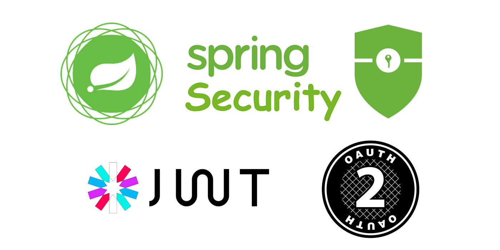
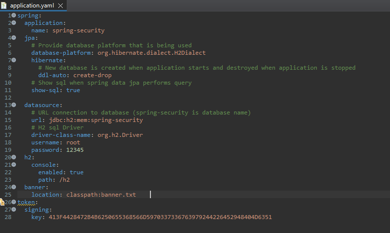
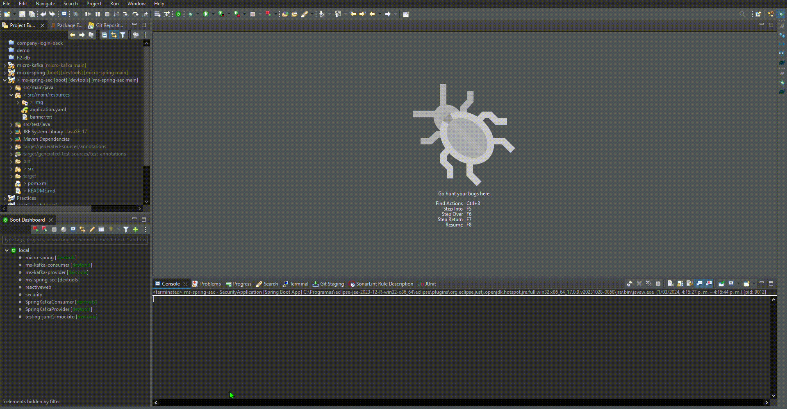
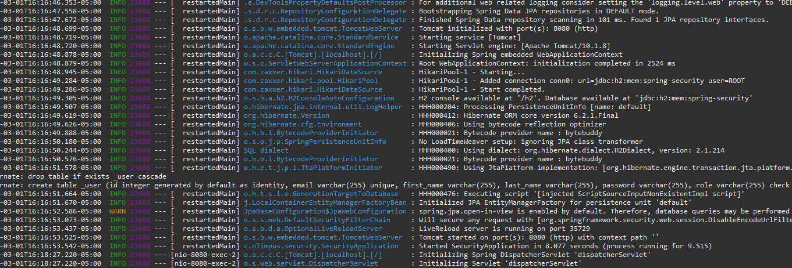
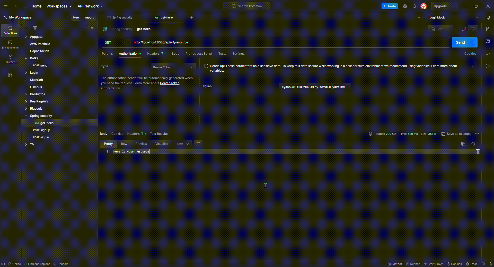

# Micro Spring Security



Spring security integration with restful web services, Bearer token

## Tech Stack

**Java:** 17

**Spring:** 3.1.0-RC1

**Spring Data:** H2

**Spring Security:** OAuth2

## Installation

Install ms-spring-sec with maven

```bash
  mvn clean install ms-spring-sec
```

You can change configurations in application.properties




## Deployment

To deploy this project run spring boot





## Test

To Test import the postman collection

/ms-spring-sec/src/main/resources/Spring security.postman_collection.json



## Authors

- [@Rubencho](https://github.com/rubenchomazo/)


## References

- [@buingoctruong](https://github.com/buingoctruong/springboot3-springsecurity6-jwt) 
- [@buingoctruongmedium](https://medium.com/@truongbui95/jwt-authentication-and-authorization-with-spring-boot-3-and-spring-security-6-2f90f9337421) 